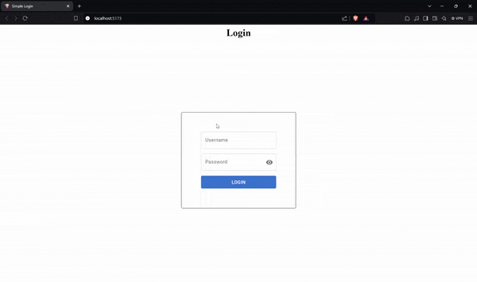

# Simple React & Material UI Login Page

A login page using React and Material UI with basic form validation.

<div align="center">



</div>

## Run Locally

Clone the project

```bash
  git clone https://github.com/AdhamElRouby/Simple-React-Login-Page.git
```

Go to the project directory

```bash
  cd .\Simple-React-Login-Page
```

Open with VSCode

```bash
  code .
```

Install dependencies

```bash
  npm install
```

Open with live server

```bash
  npm run dev
```
